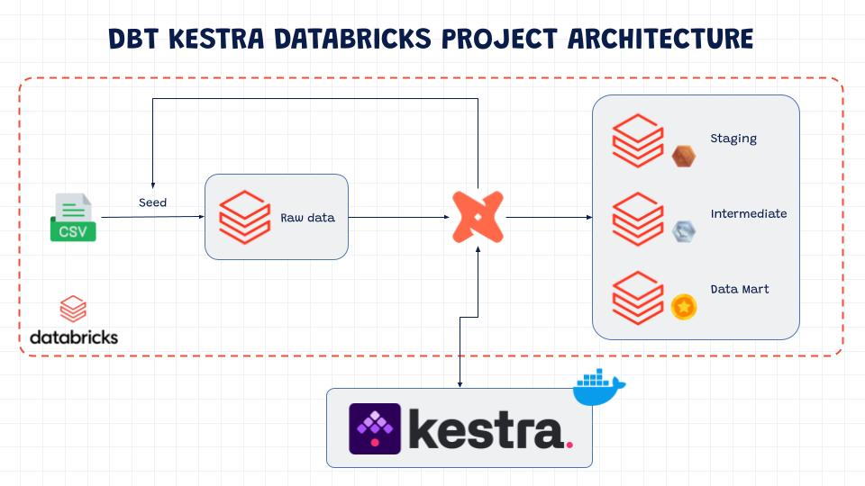
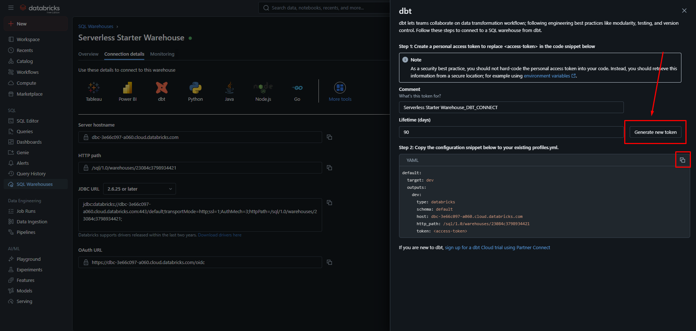
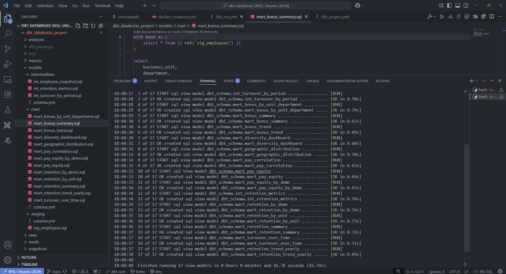
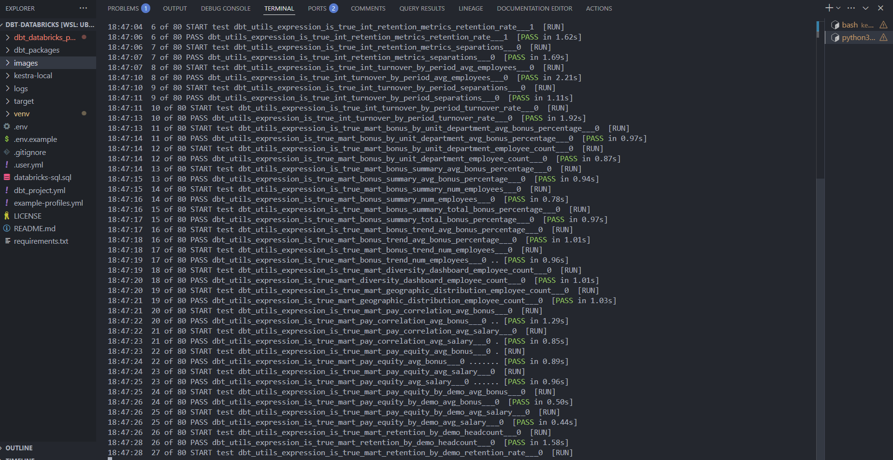
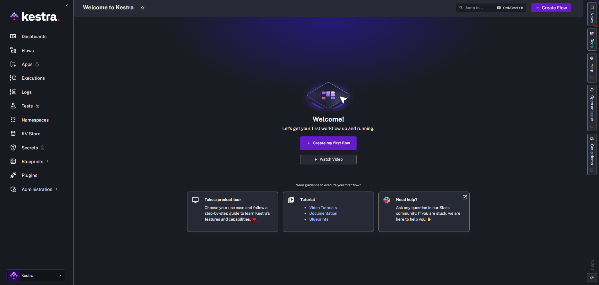
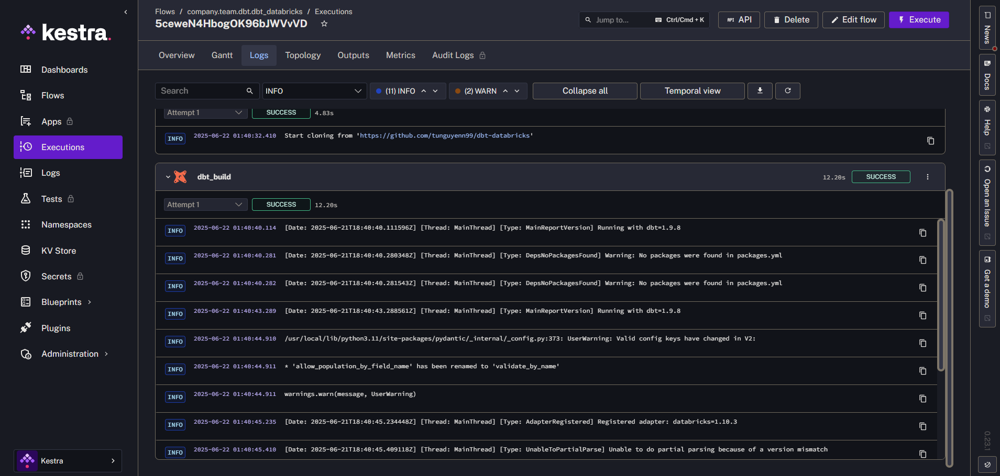
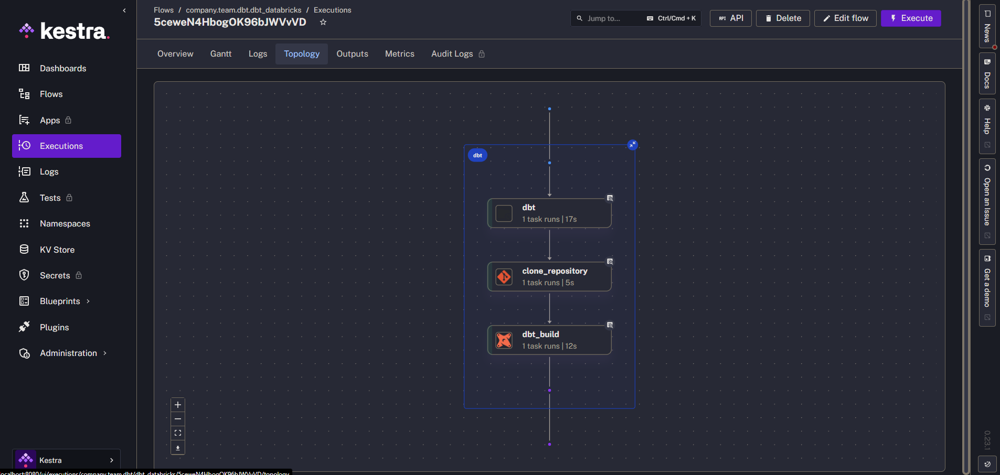
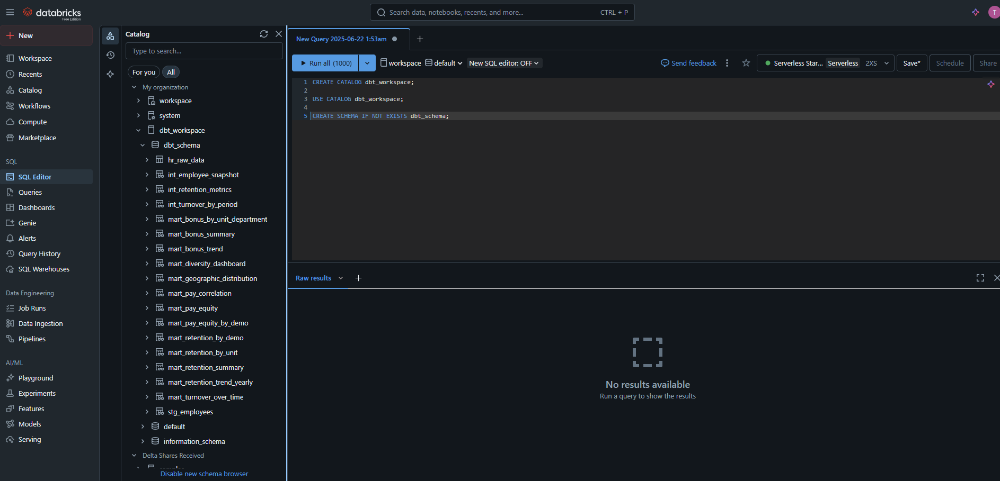
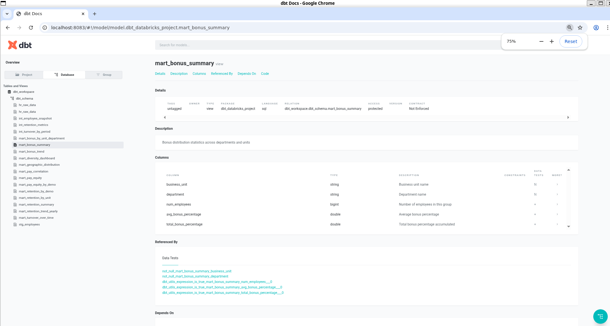

# 🧠 HR Analytics with dbt, Databricks & Kestra

This project demonstrates a modern data pipeline for **HR analytics** using [**dbt**](https://www.getdbt.com/), [**Databricks**](https://www.databricks.com/), and [**Kestra**](https://kestra.io/). It explores workforce data to uncover insights about **diversity**, **retention**, and **pay equity**.

---

## 🧰 Tech Stack

- **DBT (Data Build Tool)** – SQL-based transformation framework used to build modular, testable, and maintainable data pipelines.
- **Databricks** – Unified analytics platform providing a cloud-native **Delta Lake** storage and compute layer for processing and persisting both raw and modeled data.
- **Kestra** – Modern workflow orchestrator that manages and automates data workflows. Used here to schedule and run DBT pipelines on Databricks, all via Docker-based infrastructure.



---

## 🔧 Step 1: Setup Databricks Free Edition

We use the new **Databricks Free Edition** for this project.

- Sign up at: [https://www.databricks.com/learn/free-edition](https://www.databricks.com/learn/free-edition)
- Create a SQL Warehouse
- Generate a personal access token for authentication

📷 Screenshot:  


---

## 🛠️ Step 2: Local DBT Setup

1. Install dependencies:

```bash
python3 -m venv venv
source venv/bin/activate
pip install -r requirements.txt
```

2. Configure `.env`:

```
DATABRICKS_TOKEN=your_token_here
```

3. Initialize DBT:

```bash
dbt debug
dbt build
```

📷 Screenshots:
- `dbt run`: 
- `dbt test`: 

---

## ⚙️ Step 3: Orchestrate with Kestra

We use **Kestra with Docker Compose** to schedule and orchestrate the pipeline.

📷 Screenshot:  


### Flow Definition (`flows/dbt_run.yml`)

```yaml
id: dbt_databricks
namespace: company.team.dbt

tasks:
  - id: dbt
    type: io.kestra.plugin.core.flow.WorkingDirectory
    tasks:
      - id: clone_repository
        type: io.kestra.plugin.git.Clone
        url: https://github.com/tunguyenn99/dbt-databricks
        branch: main

      - id: dbt_build
        type: io.kestra.plugin.dbt.cli.DbtCLI
        taskRunner:
          type: io.kestra.plugin.scripts.runner.docker.Docker
        containerImage: ghcr.io/kestra-io/dbt-databricks:latest
        commands:
          - dbt deps
          - dbt build
        profiles: |
          dbt_databricks:
            outputs:
              dev:
                type: databricks
                catalog: dbt_workspace
                schema: dbt_schema
                host: dbc-3e66c097-a060.cloud.databricks.com
                http_path: /sql/1.0/warehouses/23084c3798934421
                token: "{{ env.DATABRICKS_TOKEN }}"
                threads: 1
            target: dev
```

📷 Screenshots:
- Flow Structure: 
- Successful Task Log: 

---

## 📊 Step 4: Final Results in Databricks

After executing the flow, the models and metrics are loaded into Databricks SQL.

📷 Screenshot:  


## 🔗 Lineage

I execute some more bash commands to build dbt docs:

```bash
dbt docs generate
dbt docs serve --port 8083
```

📷 Screenshot:  


---

## 🎯 Analysis Objectives

We use the pipeline to answer key HR questions:

- How diverse is the workforce in terms of **gender**, **ethnicity**, and **age**?
- Is there a correlation between **pay levels**, **departments**, and **job titles**?
- What is the **geographic distribution** of employees?
- What are the **yearly employee retention trends**?
- What is the retention rate segmented by **gender**, **ethnicity**, and **age**?
- Which **business unit** has the highest and lowest **employee retention rate**?
- Which **business unit** and **department** pays the highest and lowest **annual bonuses**?
- What does the **historical bonus trend** look like?
- How can we demonstrate **pay equity** across **gender**, **ethnicity**, and **age**?
- What is the **employee turnover rate** (monthly, quarterly, annually) since 2017?

### Turnover Rate Formula

```text
Turnover Rate (%) = (Number of Separations / Average Number of Employees) × 100
```

> Example: 5 separations, avg 52.5 employees → Turnover ≈ 9.52%

---

## 📁 Project Structure

```
.
├── dbt_databricks_project/      # DBT models & config
├── images/                      # Visual walkthrough
├── kestra-local/                # Docker setup for Kestra
│   └── flows/dbt_run.yml
├── docker-compose.yml           # Orchestration environment
├── .env                         # Secrets (excluded from Git)
├── README.md                    # You're here!
```

---

## 👤 Author

- [@tunguyenn99](https://github.com/tunguyenn99)

This project was built for learning and demonstrating real-world analytics workflows in modern data platforms.